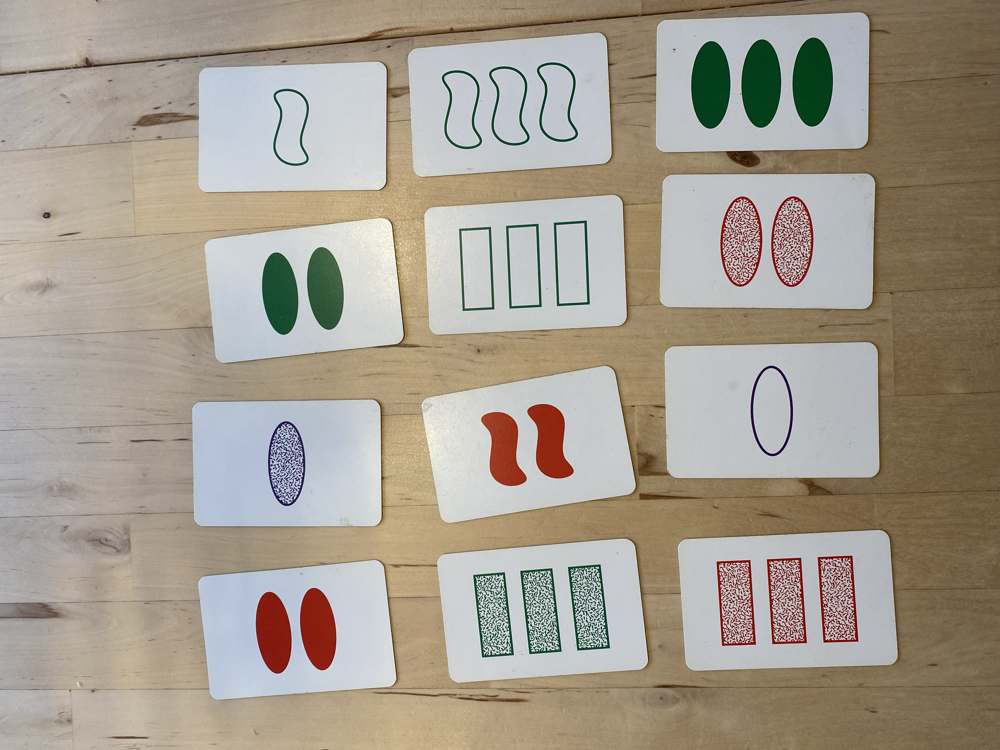

# Let Them Play Set!

## TL;DR: Traditional large language models struggle with playing Set, but newer reasoning models like DeepThink-R1 and o3-mini are able to solve it reliably.

Set is a card game where players have to identify sets of three cards from a layout of 12. Each card features a combination of four attributes: shape, color, number, and shading. A valid set consists of three cards where each attribute is either the same on all three cards or different on each. The goal is to find such sets quickly and accurately.

Though this game is a solved computer problem — easily tackled by algorithms or deep learning — I thought it would be interesting to see if Large Language Models (LLMs) could figure it out.

Here's the prompt:

```
You are given a layout of Set cards, each represented by a shorthand notation detailing their attributes. Each card can be described using the format: [Shape][Number][Color][Shading]

- Shape: D (diamond), O (oval), S (squiggle)
- Number: 1, 2, or 3 (number of shapes on the card)
- Color: R (red), G (green), P (purple)
- Shading: S (solid), O (outlined), H (hashed/shaded)

The card layout is as follows:

Top row:
1. O2RS (Two solid red ovals)
2. O1PH (One hashed purple oval)
3. O2GS (Two solid green ovals)
4. S1GO (One outlined green squiggle)

Middle row:
5. D3GH (Three hashed green diamonds)
6. S2RS (Two solid red squiggles)
7. D2GO (Two outlined green diamonds)
8. S2GO (Two outlined green squiggles)

Bottom row:
9. D3RH (Three hashed red diamonds)
10. O1PO (One outlined purple oval)
11. O2RH (Two hashed red ovals)
12. O3GS (Three solid green ovals)

Your task is to identify and list all possible Sets from this layout. A Set is a group of three cards where, for each attribute, the cards must all have the same attribute or all different attributes. Provide the sets in terms of their card numbers (e.g., Card 1, Card 2, Card 3).
```

## Results

| Model                                          | Can Find Sets | Comments                                                                                               |
| ---------------------------------------------- | ------------- | ------------------------------------------------------------------------------------------------------ |
| [`GPT-4o`](./gpt-4o/answer.md)                 | ❌            | Suggests invalid sets. After multiple verification requests, it wrongly states that there are no sets. |
| [`Sonnet-3.5`](./claude-sonnet-3.5//answer.md) | ❌            | At first attempt a clearly invalid set. After that it keeps failing, but it's honest about it.         |
| [`o3-mini`](./o3-mini/answer.md)               | ✅            | Correctly finds 3 sets after 1m 12s of thinking.                                                       |
| [`DeepThink-R1`](./deepthink-r1/answer.md)     | ✅            | Correclty finds 3 sets after 10 minutes of thinking.                                                   |

## About Set

Here’s what the game looks like:



There’s a shorthand notation for describing the attributes of a card. For instance, the card in the top left corner of the image above can be described as `O2RS`, meaning it has two solid red ovals.

Here’s the full definition of the notation:

```
[Shape][Number][Color][Shading]

Shape: O (oval), S (squiggle), D (diamond)
Number: 1, 2, or 3 (count of shapes)
Color: R (red), G (green), P (purple)
Shading: S (solid), O (outline), H (hashed/shaded)
```

Using this notation, any deck can be described in text. In this particular layout, there are three Sets:

1. Cards 3, 4, 5
2. Cards 5, 6, 10
3. Cards 10, 11, 12

My expectation was that the LLM will either be able to identify the sets or at least admit when it cannot find them. Failure I would define as suggesting invalid sets or claiming there are no sets when there are.
