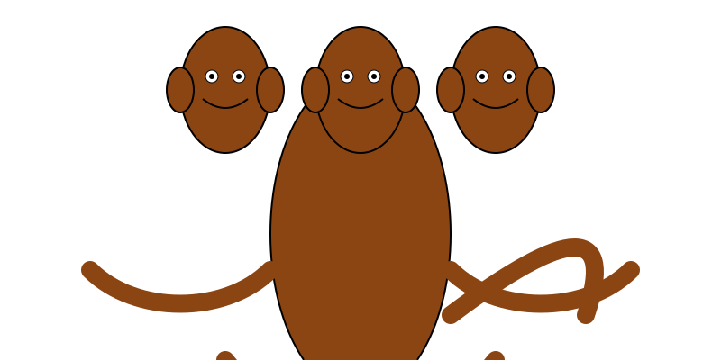
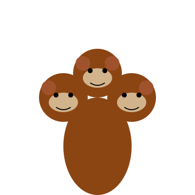
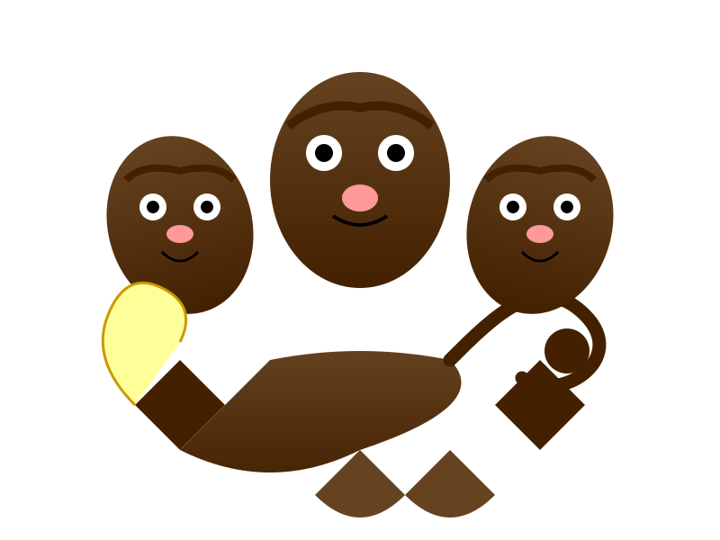
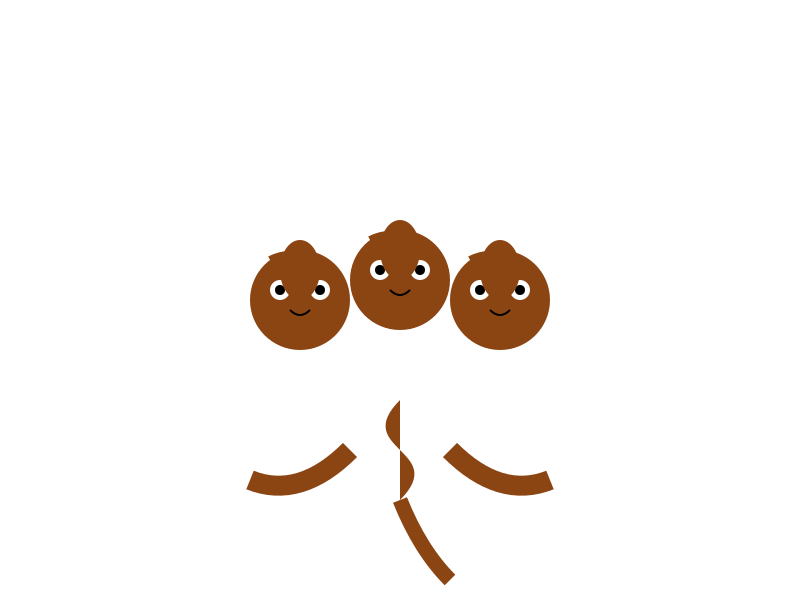
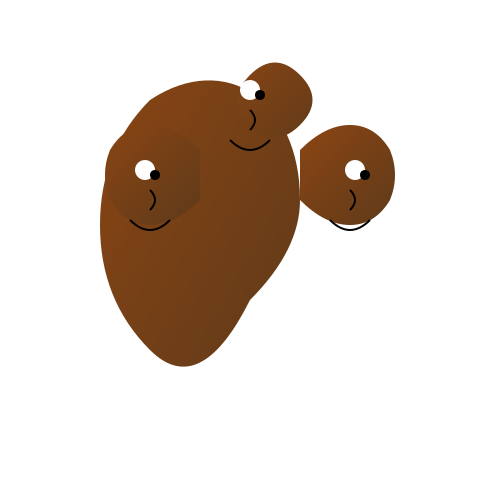
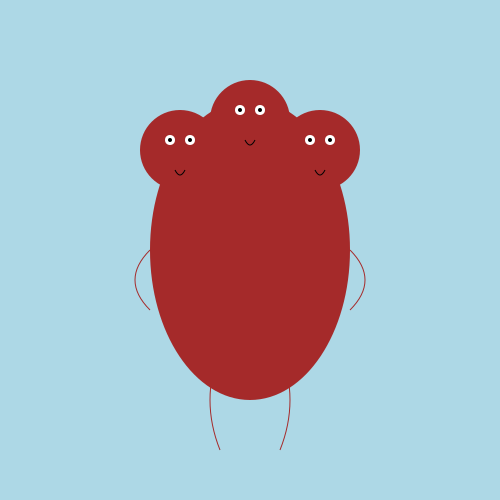

# Three-Headed Monkey

Prompt:

```
Can you generate a SVG definition of a three-headed monkey? Make it as detailed as possible. Respond with only the SVG, nothing else.
```

## Results

| Model             | SVG                          |
| ----------------- | ---------------------------- |
| GPT-3.5-turob     |      |
| GPT4-o            |             |
| GPT o1-preview    |     |
| Deepseek R1       |        |
| Claude Sonnet 3.5 |  |
| Claude Haiku 3.5  |   |
| Mistral Le Chat   |    |
